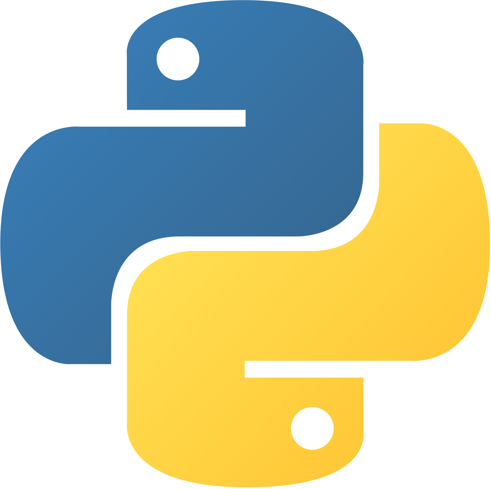
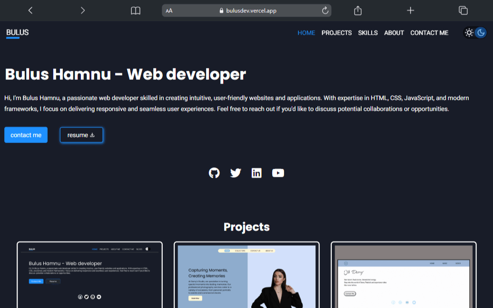
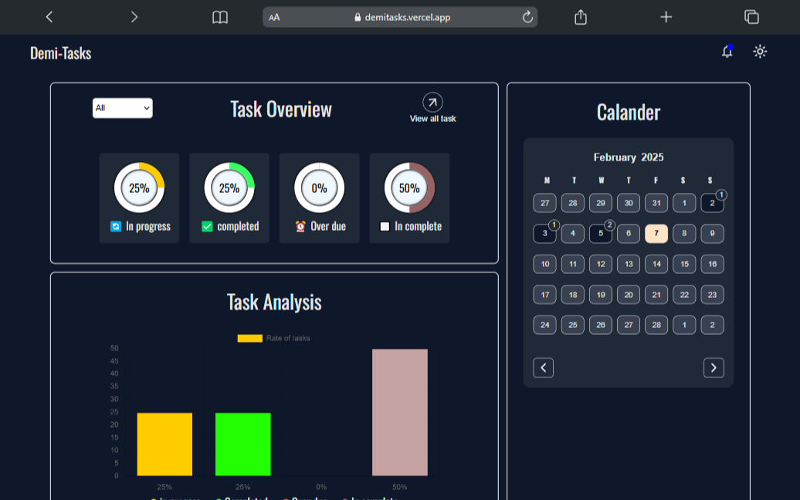
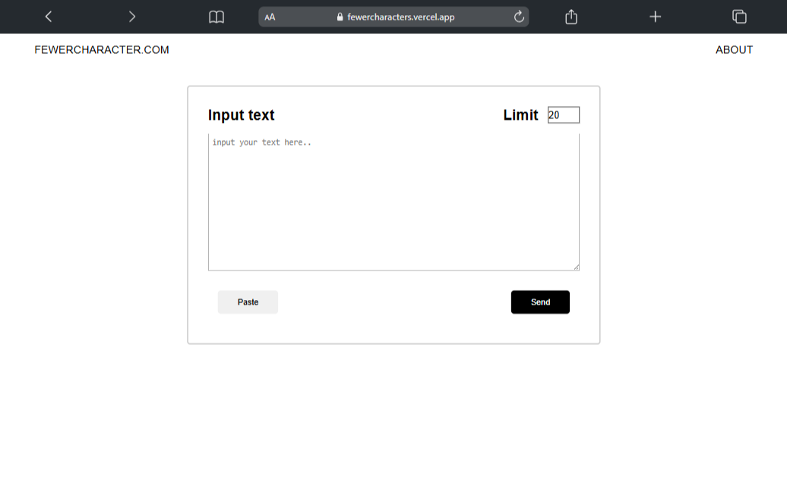

# Bulus Hamnu - Front-End Developer
Hey there! 👋🏽 I'm Bulus Hamnu Madu, a passionate developer dedicated to building clean, efficient, and user-friendly web and mobile applications. I thrive on solving complex problems and continuously learning new technologies to sharpen my skills.

I'm currently pursuing a Computer Science degree at Abubakar Tafawa Balewa University, Bauchi, Nigeria. I'm open to part-time remote jobs and internship opportunities to gain practical experience and contribute to exciting projects.

If you're looking for a collaborator in web development, app development, or any tech-related projects, feel free to reach out—I'd love to connect! 

## 🛠️ Tech Stack

  
  
  
  

## 🌟 Featured Projects

  <a href="https://bulusdev.vercel.app/index.html" target="_blank" style="text-decoration: none; color: inherit;">
    

      
      
<b>Bulus-dev portfolio V1</b>

      
This is my personal portfolio website, designed to showcase my skills, projects, and experience as a developer. It includes an 'About Me' section where I share details about my background, education, and journey as a developer.

    

  </a>
  <a href="https://demitasks.vercel.app/" target="_blank" style="text-decoration: none; color: inherit;">
    

      
      
<b>Task Manager App</b>

      
Demi Tasks Manager is a powerful tool that helps you organize tasks, track progress, and analyze productivity. It allows you to create, edit, and delete tasks, add to-dos, attachments, and due dates, and categorize tasks for better organization.

    

  </a>
  <a href="https://fewercharacters.vercel.app/" target="_blank" style="text-decoration: none; color: inherit;">
    

      
      
<b>FewerCharacters</b>

      
This project is a web application that uses a backend server to interact with the OpenAI API to shorten a given text to fit within a specified character limit while preserving its meaning. The project supports multiple responses for varied summaries.

    

  </a>
  <a href="https://bulushamnu.github.io/demys-studio/" target="_blank" style="text-decoration: none; color: inherit;">
    

      
      
<b>Demy's Studio</b>

      
Demy's Studio is a portfolio website for a photography studio to showcase its potential and display its work to the world. The website integrates with the Unsplash API to fetch high-quality images from various categories, such as products, events, and lifestyle.

    

  </a>
  

 

## 📊 GitHub Stats

  

## 🌐 Let's Connect!

